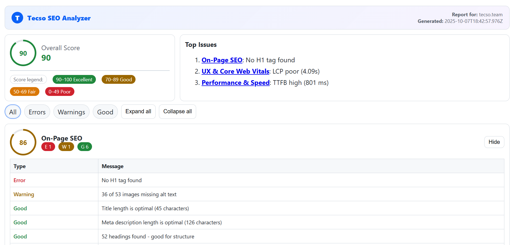

# Tecso SEO Analyzer

Actionable SEO insights for any page: on‑page, technical, content, UX, local, performance, analytics, and advanced checks — by Tecso. Learn more at https://tecso.team

## What it does
- On‑Page SEO: titles/meta, headings hierarchy, links, images (alts/size), internal/external ratios
- Technical SEO: HTTPS, viewport, canonical, robots meta, hreflang hints, favicon, minified assets
- Content Quality: content length, readability indicators, text‑to‑HTML, duplication hints, images in copy
- Off‑Page SEO: Open Graph/Twitter Cards, social links, rel attributes, basic microdata presence
- UX & Core Web Vitals: modern collection via PerformanceObserver (LCP, CLS) and INP approximation
- Local SEO: business hints in content and JSON‑LD types
- Performance & Speed: asset heuristics, image optimization, PSI optional lab metrics
- Analytics & Monitoring: analytics tags presence, tracking hints
- Advanced SEO: structured data parsing (JSON‑LD types), canonical/domain heuristics, misc extras
- Background: robots.txt and sitemap discovery; backlinks via mock or custom endpoint; badge score update

## Highlights
- Manifest V3 Chrome extension, CSP‑safe (no inline/remote scripts)
- Light/Dark/System theme modes, responsive toolbar, polished UI chips and accordions
- Settings panel to choose categories, backlink provider/endpoint, PSI toggle + API key, auto‑analyze
- Exports: JSON, CSV, and print‑friendly HTML; copy buttons for a category or all errors

## Install (developer mode)
1. Open `chrome://extensions`
2. Enable Developer mode
3. Click “Load unpacked” and select this folder (repo root)
4. Pin “Tecso SEO Analyzer” and click the icon on any site

## Usage
1. Open a typical webpage (not `chrome://`, the Chrome Web Store, or PDFs)
2. Click the extension icon → Analyze
3. Use filter chips (All / Errors / Warnings / Good) and expand cards for details
4. Export JSON/CSV/HTML or copy errors; open Settings to adjust checks

## Settings
- Categories: On‑Page, Technical, Content, Off‑Page, UX, Local, Performance, Analytics, Advanced
- Auto analyze on open: run a scan when the popup opens
- Theme mode: System / Dark / Light
- Backlinks:
	- Provider: Mock or Custom endpoint (set your API URL)
- PageSpeed Insights (PSI):
	- Enable lab metrics and supply a PSI API key

## Exports
- JSON: full structured output (scores + details)
- CSV: rows by Category/Type/Message for spreadsheets
- HTML: clean, print‑friendly report for sharing

## Screenshots

> Note: Images are stored in `image/` within this repo.

| Overview | Filters | Category Details |
|---|---|---|
|  |  |  |

| Score Circle | Export Report |
|---|---|
|  |  |

## Packaging a ZIP for the Chrome Web Store
A PowerShell script builds a clean ZIP in `Package/`.

Windows PowerShell (run from repo root or the `Package` folder):

```powershell
cd Package
./package.ps1
```

Outputs:
- `Package/dist/` — a clean copy of the extension files
- `Package/tecso-seo-analyzer.zip` — upload this to the Chrome Web Store

To test the packaged folder locally:
1. `chrome://extensions` → Developer mode → Load unpacked
2. Select `Package/dist/`

## Author & Links
- Author: [Sobhan Azimzadeh](https://github.com/sobhanaz)
- Agency: [Tecso Digital Agency](https://tecso.team)
- Resume: https://cv.tecso.team/

## Permissions
- `activeTab`, `scripting`, `storage`, `webNavigation`, `contextMenus`
- Host permissions: `<all_urls>` — required to analyze the current page and discover robots.txt/sitemap

## Privacy
- No tracking or analytics are sent by default.
- If you configure a custom backlinks endpoint, requests will go to that API for backlink metrics.

## Troubleshooting
- “Cannot analyze this page” → Some pages (Chrome Web Store, `chrome://` URLs, PDFs) do not allow content scripts. Try another site.
- Black/empty popup → Reload the page and click Analyze again; ensure the site allows scripts.
- Clipboard not working → Copy actions require a user gesture; click the copy button again after a user interaction.
- No PSI data → Ensure PSI is enabled in Settings and a valid API key is provided.

## File structure
```
seo-checker/
├── manifest.json          # Extension configuration (MV3)
├── popup.html             # Popup layout and styles
├── popup_app.js           # Popup logic (UI, settings, exports, messaging)
├── content.js             # In‑page analysis
├── background.js          # Robots/sitemap/backlinks, PSI, badge updates
├── icons/                 # Icons (16/32/48/128)
└── Package/               # Packaging script and outputs
		├── package.ps1        # Builds dist/ and tecso-seo-analyzer.zip
		└── README.md          # Packaging instructions
```

## License
MIT License © 2025 Tecso — see `LICENSE`.